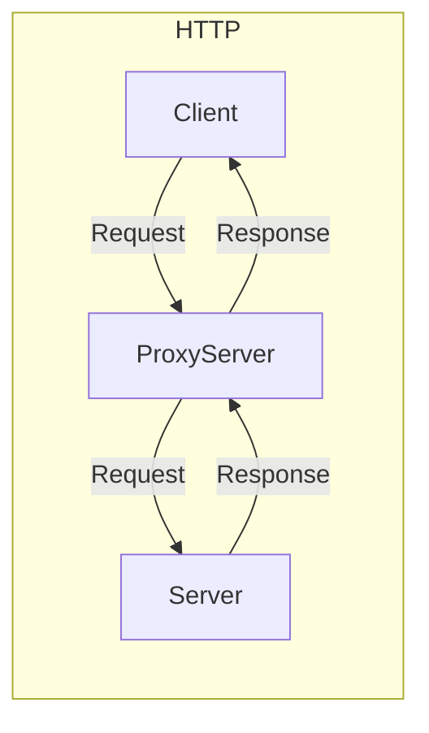

## Introduction
When you doing this programming assignment, you can modify Client and Server in the [ Programming Assignment_1 of Chapter2 ](https://github.com/LVvVQ/Computer_Netwoking_A_Top_Down_Approach/tree/master/Chapter2/Programming_Assignment_1), so that you have your own `Client` , `Server` and `ProxyServer`.

Then you can use Client to send request to ProxyServer, then forward the request to Server throught ProxyServer.


--------------------------------------------------------

## Client
> If you use my `Client.py`, please refer to the following format:
``` shell
python3 Client.py <ProxyAddr> <ProxyPort> <Domain>
Example:
    python3 Client.py 127.0.0.1 8888 http://127.0.0.1/hello.html
```

## Server
> If you use my `Client.py`, please refer to the following format:
``` shell
python3 Server.py <ServerAddr> <ServerPort>
Example:
    python3 Server.py 127.0.0.1 8080
```

## ProxyServer
> If you use my `ProxyServer.py`, please refer to the following format
>
>you need to pay attention to ProxyServer will forward the request to **`Remote Server listening port`**
``` shell
python3 ProxyServer.py <ProxyServerAddr> <ProxyServerPort> <RemoteServerPort>
Example:
    python3 ProxyServer 127.0.0.1 8888 8080
```
